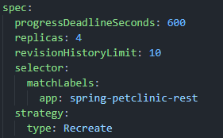

# Tutorial: Hello Minikube
## 1. Before and After Exposed As Service
### Before

### After

### Answer
Before, there was only two lines of log statement.
- Started HTTP server on port 8080
- Started UDP server on port 8081

It shows which ports the application is listening to and what protocol is used. On port 8080, the application uses the HTTP protocol while 8081 uses the UDP protocol. However, before it's exposed as service, these ports are only exposed inside the cluster and can't be accessed outside of it. After the it is exposed as a service, we can access it from outside the cluster. On the "After" logs, we can see some lines of log statement with the detail "GET /". This just shows that a client accessed the server's resource through the GET method on url "/".

## 2. 'kubectl get' Invocations
### kubectl get \[resource type (ex: pods, deployments)\]
This gets the list of resource in the default namespace. `kubectl get pods` is the same as `kubectl get pods -n default`.
### kubectl get \[resource type (ex: pods, deployments)\] -n \[namespace\]
This gets the list of resource in the specified namespace.

# Rolling Update & Kubernetes Manifest File
## 1. Difference between Rolling Update and Recreate Strategy
## 2. Deploy using Recreate Deployment Strategy
I copied the deployment.yaml that uses Rolling Update and updated the value of spec.strategy.type from RollingUpdate to Recreate and deleted spec.strategy.rollingUpdate specifications.

Then I deployed the created yaml.

## 3. Prepare Manifest File for Recreate Strategy Deployment
It has been created due to the the previous question.

## 4. Benefits of Using Kubernetes Manifest Files
When deploying it manually, we need to create deployment and manually specify the specifications everytime. If we create a manifest file, when we need to deploy something with the same specification, we could just apply the file. No need to specify it again.
